# Answer Generation Flow - Mermaid Diagram

```mermaid
flowchart TD
    Start([Raw Query Request]) --> ValidateQuery{Validate Query}
    ValidateQuery -->|Empty| Error1[Return 400 Error]
    ValidateQuery -->|Valid| GetRetriever[Get HybridRetriever from app.state]

    GetRetriever --> RetrieveStart[Start Retrieval]

    RetrieveStart --> GenTextEmbedding[Generate Query Embedding<br/>TextEmbedder.embed_text<br/>query: prefix for e5-base-v2]
    GenTextEmbedding --> GenImageEmbedding[Generate Image Query Embedding<br/>ImageEmbedder.embed_text<br/>1024 dimensions]

    GenImageEmbedding --> ParallelRetrieval[Parallel Retrieval<br/>asyncio.gather]

    ParallelRetrieval --> BM25Search[BM25 Sparse Search<br/>SparseRetriever.retrieve<br/>Elasticsearch]
    ParallelRetrieval --> VectorTextSearch[Vector Search Text Chunks<br/>DenseRetriever.retrieve_with_embedding<br/>Qdrant text_chunks collection]
    ParallelRetrieval --> VectorTableSearch[Vector Search Table Chunks<br/>TableRetriever.retrieve_with_embedding<br/>Qdrant table_chunks collection]
    ParallelRetrieval --> VectorImageSearch[Vector Search Image Chunks<br/>ImageRetriever.retrieve_with_embedding<br/>Qdrant image_chunks collection]

    BM25Search --> MergeResults["Merge & Deduplicate Results<br/>by chunk_id"]
    VectorTextSearch --> MergeResults
    VectorTableSearch --> MergeResults
    VectorImageSearch --> MergeResults

    MergeResults --> NormalizeScores[Normalize Scores<br/>Min-Max normalization<br/>per score type]
    NormalizeScores --> CombineScores[Combine Scores<br/>Weighted average:<br/>sparse 0.2, dense 0.3,<br/>table 0.2, image 0.3]
    CombineScores --> SortResults[Sort by Combined Score<br/>Return Top-N chunks]

    SortResults --> CheckEmpty{Chunks Found?}
    CheckEmpty -->|No| ReturnEmpty[Return Empty Response<br/>No information message]
    CheckEmpty -->|Yes| GenAnswer[AnswerGenerator.generate_answer]

    GenAnswer --> FormatContext[Format Context from Chunks<br/>_format_context]

    FormatContext --> ProcessChunks[Process Each Chunk]
    ProcessChunks --> CheckChunkType{Chunk Type?}

    CheckChunkType -->|text| FormatTextChunk["Format Text Chunk<br/>&#91;Document: filename, Chunk: N&#93;<br/>chunk_text"]
    CheckChunkType -->|table| FormatTableChunk[Format Table Chunk<br/>Use table_markdown if available<br/>else chunk_text]
    CheckChunkType -->|image| ProcessImage[Process Image Chunk]

    ProcessImage --> CheckVisionMode{Vision LLM Mode?}
    CheckVisionMode -->|Yes| VisionLLMProcess[Download Image from Supabase<br/>VisionProcessor.process_image<br/>with query context]
    CheckVisionMode -->|No| UseStoredCaption[Use Stored Caption]
    VisionLLMProcess --> GenerateImageURL[Generate Signed Image URL<br/>SupabaseImageStorage.get_image_url]
    UseStoredCaption --> GenerateImageURL
    GenerateImageURL --> FormatImageChunk["Format Image Context<br/>&#91;Image: description&#93;<br/>Image URL<br/>Instructions for charts/graphs"]

    FormatTextChunk --> BuildContext[Build Context String]
    FormatTableChunk --> BuildContext
    FormatImageChunk --> BuildContext

    BuildContext --> CheckLength{Context Length<br/>&lt; max_length?}
    CheckLength -->|Yes| AddChunk[Add Chunk to Context]
    CheckLength -->|No| TruncateContext[Truncate Context]
    AddChunk --> MoreChunks{More Chunks?}
    TruncateContext --> MoreChunks
    MoreChunks -->|Yes| ProcessChunks
    MoreChunks -->|No| BuildPrompt[Build Prompt]

    BuildPrompt --> SystemPrompt[System Prompt<br/>Default instructions:<br/>- Answer from context only<br/>- Markdown format<br/>- Cite sources<br/>- Use image descriptions]
    BuildPrompt --> UserPrompt["User Prompt Template<br/>Context: {context}<br/>Question: {question}"]

    SystemPrompt --> CallGroqAPI[Call Groq API<br/>client.chat.completions.create]
    UserPrompt --> CallGroqAPI

    CallGroqAPI --> GroqRequest[Groq API Request<br/>model: settings.groq_model<br/>messages: system + user<br/>temperature: 0.0<br/>max_tokens: 1000]

    GroqRequest --> GroqResponse["Groq API Response<br/>response.choices[0].message.content"]

    GroqResponse --> ExtractAnswer["Extract Raw Answer<br/>response.choices[0].message.content.strip"]

    ExtractAnswer --> ExtractSources{Include Sources?}
    ExtractSources -->|Yes| ParseCitations["Parse Citations from Answer<br/>Regex: Document: filename, Chunk: N"]
    ExtractSources -->|No| SkipSources[Skip Source Extraction]

    ParseCitations --> FormatSources[Format Source Info<br/>chunk_id, document_id,<br/>filename, chunk_index,<br/>chunk_text, citation]
    FormatSources --> ExtractTokens[Extract Token Usage<br/>prompt_tokens, completion_tokens,<br/>total_tokens]
    SkipSources --> ExtractTokens

    ExtractTokens --> BuildResponse[Build QueryResponse<br/>answer, sources, chunks_used,<br/>model, tokens_used,<br/>retrieval_stats]

    BuildResponse --> ReturnResponse([Return Response<br/>Raw LLM Output + Metadata])

    Error1 --> End([End])
    ReturnEmpty --> End
    ReturnResponse --> End

    style Start fill:#e1f5ff
    style ReturnResponse fill:#c8e6c9
    style Error1 fill:#ffcdd2
    style ReturnEmpty fill:#fff9c4
    style CallGroqAPI fill:#f3e5f5
    style GroqResponse fill:#f3e5f5
    style ParallelRetrieval fill:#e8f5e9
    style MergeResults fill:#fff3e0
```



## Key Components

### 1. Query Endpoint (`/api/v1/query`)

- **File**: `backend/app/api/routes/query.py`
- Validates query input
- Orchestrates retrieval and generation

### 2. Hybrid Retrieval (`HybridRetriever`)

- **File**: `backend/app/services/retrieval/hybrid_retriever.py`
- Generates embeddings (text and image)
- Parallel retrieval from 4 sources:
  - **BM25 Sparse Search**: Elasticsearch (keyword matching)
  - **Vector Text Search**: Qdrant `text_chunks` collection
  - **Vector Table Search**: Qdrant `table_chunks` collection
  - **Vector Image Search**: Qdrant `image_chunks` collection
- Merges, deduplicates, normalizes, and combines scores
- Returns top-N chunks

### 3. Answer Generation (`AnswerGenerator`)

- **File**: `backend/app/services/generation/answer_generator.py`
- Formats context from chunks:
  - Text chunks: Direct text with citation
  - Table chunks: Markdown table format
  - Image chunks: Image description + URL (with optional Vision LLM processing)
- Builds prompt (system + user)
- Calls Groq API
- Extracts answer and sources

### 4. LLM Call (Groq)

- **Model**: Configured via `GROQ_MODEL` setting
- **Temperature**: 0.0 (deterministic)
- **Max Tokens**: 1000
- **System Prompt**: Instructions for context-based answering
- **User Prompt**: Context + Question

### 5. Response Formatting

- Extracts raw answer from LLM response
- Parses citations from answer text
- Formats source information
- Returns structured response

### 6. Vision Processing Mode

Vision mode determines how images are processed during answer generation:

- **Captioning Mode** (default): Uses pre-generated captions stored during document ingestion
  - Faster (no API calls during query)
  - Uses local BLIP models for captioning
  - Captions are generated once during ingestion
  
- **Vision LLM Mode**: Uses Vision LLM APIs (GPT-4V, Claude, etc.) for real-time image understanding
  - More accurate and context-aware (processes images with the actual query)
  - Requires API keys (OpenAI or Anthropic)
  - Processes images on-demand during query time
  - Better for complex charts, graphs, and diagrams

#### How to Set Vision Mode

Vision mode is controlled by the `vision_processing_mode` setting in `backend/app/core/config.py`:

1. **Via Environment Variable** (Recommended):
   ```bash
   # In backend/.env file
   VISION_PROCESSING_MODE=vision_llm  # or "captioning"
   ```

2. **Configuration Options**:
   - `vision_processing_mode`: `"captioning"` (default) or `"vision_llm"`
   - `vision_llm_provider`: `"openai"` or `"anthropic"` (when using vision_llm mode)
   - `vision_llm_model`: Model name (e.g., `"gpt-4-vision-preview"` for OpenAI)

3. **When Vision LLM Mode is Enabled**:
   - `AnswerGenerator` initializes a `VisionProcessor` during startup
   - When processing image chunks, it downloads the image from Supabase
   - Calls the Vision LLM API with the image and query context
   - Uses the Vision LLM's analysis as the image description instead of stored captions

4. **When Captioning Mode is Used** (default):
   - `AnswerGenerator` does not initialize a VisionProcessor
   - Uses captions that were generated during document ingestion
   - Faster response times, no additional API calls

**Note**: Vision LLM mode requires appropriate API keys:
- For OpenAI: Set `OPENAI_API_KEY` environment variable
- For Anthropic: Set `ANTHROPIC_API_KEY` environment variable

## Data Flow

1. **Raw Query** → String input
2. **Query Embedding** → Vector representation (text: 768 dim, image: 1024 dim)
3. **Retrieved Chunks** → List of chunk dictionaries with scores
4. **Formatted Context** → String with citations and chunk text
5. **Prompt** → System + User messages
6. **Groq API Call** → HTTP request to Groq
7. **Raw LLM Output** → `response.choices[0].message.content`
8. **Final Response** → Structured JSON with answer, sources, metadata
