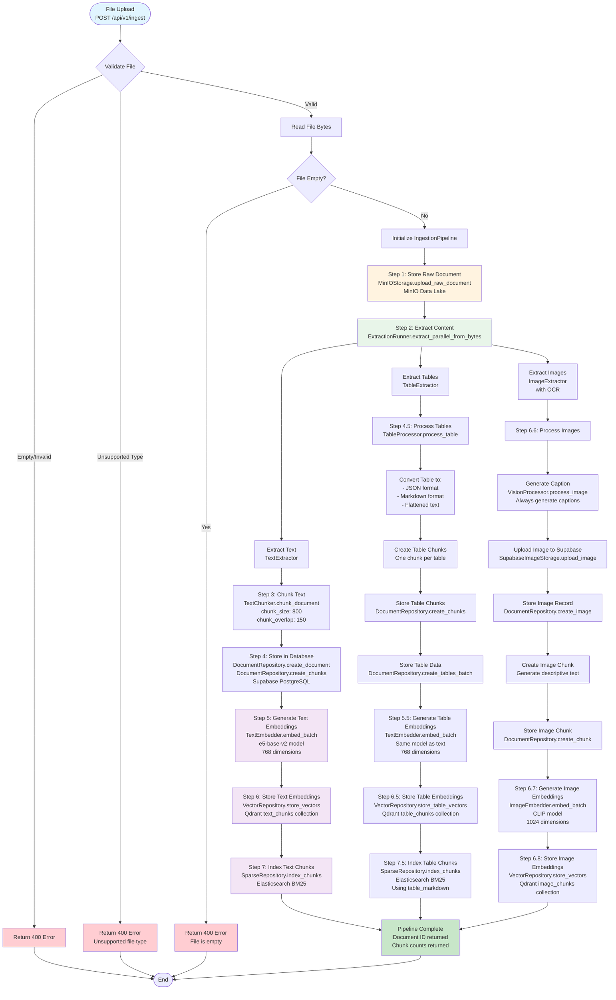

# Document Processing Flow - Mermaid Diagram

## Key Components

### 1. Ingestion Endpoint (`/api/v1/ingest`)
- **File**: `backend/app/api/routes/ingest.py`
- Accepts file uploads (PDF, DOCX, TXT, MD)
- Validates file type and size
- Orchestrates the complete ingestion pipeline

### 2. Ingestion Pipeline (`IngestionPipeline`)
- **File**: `backend/app/services/ingestion/pipeline.py`
- Orchestrates the complete document processing flow
- Coordinates extraction, chunking, embedding, and indexing

### 3. Content Extraction (`ExtractionRunner`)
- **Parallel extraction** of text, tables, and images
- Uses OCR for text extraction from images
- Extracts structured data (tables) and visual content (images)

### 4. Chunking (`TextChunker`)
- Splits text into semantic chunks
- Default: 800 tokens per chunk, 150 token overlap
- Preserves document structure

### 5. Table Processing (`TableProcessor`)
- Converts tables to multiple formats:
  - **JSON**: Structured data format
  - **Markdown**: Human-readable table format
  - **Flattened text**: For embedding generation
- Creates one chunk per table

### 6. Image Processing
- **Upload**: Stores images in Supabase Storage
- **Captioning**: Always generates captions using captioning processor (BLIP-2, etc.)
- **OCR**: Extracts text from images
- Creates descriptive chunks for images
- Note: Vision LLM mode can still be used at query time for enhanced understanding

### 7. Embedding Generation
- **Text Embeddings**: `TextEmbedder` (e5-base-v2, 768 dim)
- **Table Embeddings**: Same model as text (768 dim)
- **Image Embeddings**: `ImageEmbedder` (CLIP, 1024 dim)
- Batch processing for efficiency

### 8. Vector Storage (Qdrant)
- **text_chunks**: Text chunk embeddings
- **table_chunks**: Table chunk embeddings
- **image_chunks**: Image chunk embeddings
- Each collection stores vectors with metadata payloads

### 9. Sparse Indexing (Elasticsearch)
- **BM25 indexing** for keyword search
- Indexes text chunks and table chunks (using markdown)
- Enables hybrid search (sparse + dense)

## Data Flow

1. **Raw File** → File bytes uploaded via API
2. **MinIO Storage** → Raw document stored in data lake
3. **Extracted Content** → Text, tables, and images extracted
4. **Chunks** → Text split into chunks, tables and images processed
5. **Database** → Document and chunks stored in Supabase PostgreSQL
6. **Embeddings** → Vector representations generated
7. **Qdrant** → Embeddings stored in vector database
8. **Elasticsearch** → Chunks indexed for BM25 search
9. **Complete** → Document ready for retrieval

## Storage Systems

- **MinIO**: Raw document storage (data lake)
- **Supabase PostgreSQL**: Document and chunk metadata
- **Supabase Storage**: Image files
- **Qdrant**: Vector embeddings (3 collections)
- **Elasticsearch**: BM25 sparse index

## Processing Modes

### Vision Processing Modes:
- **captioning**: Always generates captions during ingestion (default behavior)
- **vision_llm**: Can be used at query time for enhanced image understanding (in addition to captions)

